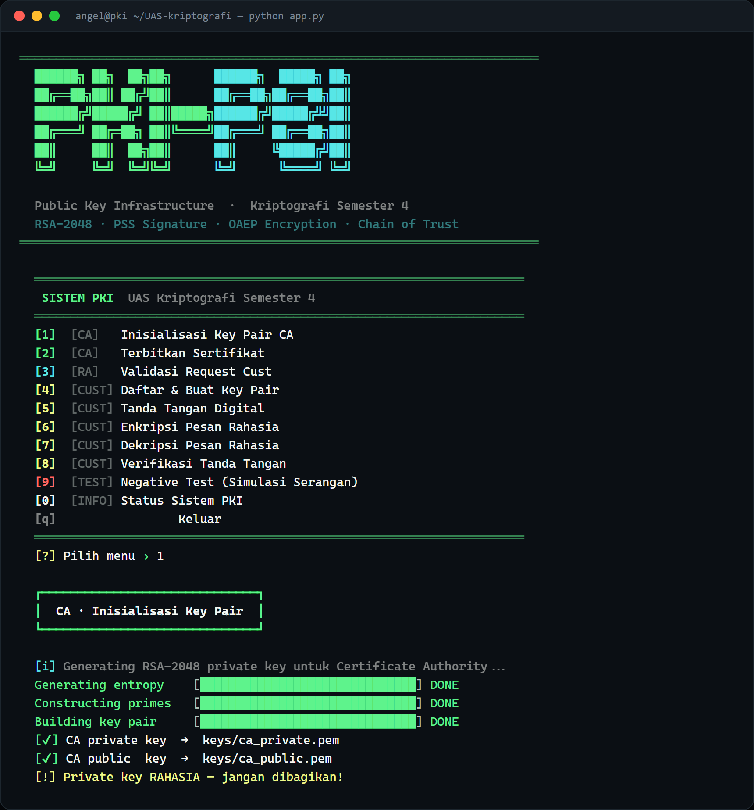

# PKI Simulation — Public Key Infrastructure

A terminal-based simulation of a complete **Public Key Infrastructure**: a Certificate Authority (CA) and Registration Authority (RA) that issue certificates, and clients that sign, encrypt, decrypt, and verify messages against a chain of trust. Built as the Semester 4 Cryptography final project.



## Overview

The project models how trust is established on the open internet without any pre-shared secret. A client generates its own RSA key pair and submits a signing request; the RA validates the request; the CA issues a certificate by signing the client's public key with its own private key. From then on, anyone holding the CA's public key can verify that a certificate — and therefore the key inside it — is authentic, forming a **chain of trust**.

## What it demonstrates

- **RSA-2048** key-pair generation for the CA and every client
- **Certificate issuance** — the CA signs `subject | public key | timestamp` with RSA-PSS
- **Registration Authority workflow** — certificate signing requests (CSRs) are reviewed and approved/rejected before the CA will sign
- **Digital signatures** with RSA-PSS (MGF1 + SHA-256)
- **Confidential messaging** with RSA-OAEP (MGF1 + SHA-256)
- **Verification against the chain of trust** — a signature is only trusted after the signer's certificate is verified against the CA's public key
- **Negative tests** — message tampering, signature replay, and forged (un-signed) certificates are all detected and rejected

## Roles

| Role | Responsibility |
|------|----------------|
| **Certificate Authority (CA)** | Root of trust. Holds the CA key pair and signs certificates. |
| **Registration Authority (RA)** | Vets certificate signing requests before they reach the CA. |
| **Client** | Generates a key pair, requests a certificate, then signs / encrypts / verifies messages. |

## Requirements

- Python 3.10+
- [`cryptography`](https://pypi.org/project/cryptography/)

## Setup & run

```bash
git clone https://github.com/GianneAngely/UAS-kriptografi-semester-4.git
cd UAS-kriptografi-semester-4
pip install -r requirements.txt
python app.py
```

To start from a clean slate, delete the generated `keys/`, `requests/`, `certs/`, and `messages/` folders before running.

## Menu

| Key | Actor | Action |
|-----|-------|--------|
| `1` | CA | Initialize the CA key pair |
| `2` | CA | Issue a certificate |
| `3` | RA | Validate a client's request |
| `4` | Client | Register and generate a key pair |
| `5` | Client | Digitally sign a message |
| `6` | Client | Encrypt a confidential message |
| `7` | Client | Decrypt a message |
| `8` | Client | Verify a signature and certificate |
| `9` | Test | Negative tests (attack simulation) |
| `0` | Info | System status |

## Typical flow

1. The CA initializes its key pair `[1]`.
2. A client registers and generates keys, producing a CSR `[4]`.
3. The RA reviews and approves the CSR `[3]`.
4. The CA issues the client's certificate `[2]`.
5. The client signs `[5]` or encrypts `[6]` a message for a recipient.
6. The recipient decrypts `[7]` and verifies both the signature and the certificate chain `[8]`.
7. The negative tests `[9]` show tampered, replayed, and forged inputs being rejected.

## Cryptographic details

- **Keys:** RSA-2048, public exponent 65537
- **Signatures:** RSA-PSS with MGF1 and SHA-256, maximum salt length
- **Encryption:** RSA-OAEP with MGF1 and SHA-256
- **Certificate:** `subject | public_key | issued_at`, signed by the CA private key; verification recomputes that payload and checks the CA signature before any client key is trusted

## Project layout

- `app.py` — the full interactive PKI system used in the walkthrough above
- `ca.py`, `ra.py`, `cust1.py`, `cust2.py`, `cust3.py` — standalone per-role scripts for running the same protocol as a multi-party demo, one participant per role
- `requirements.txt`

## Note

Educational project. All keys and certificates are generated locally for demonstration and are not intended for production use.
